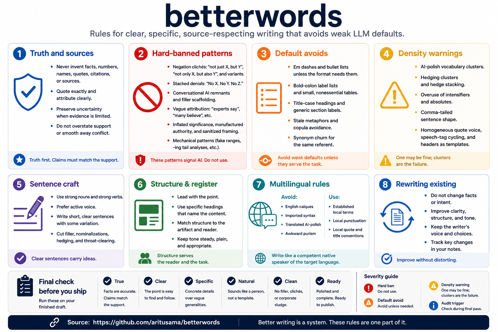

# betterwords



betterwords is a rule set for production writing: articles, reports, reviews, release notes, specs, newsletters, scripts, slide text, and other durable text artifacts.

It ships as a Codex skill, a Codex plugin, and a portable Markdown rule file for other assistants.

## What it does

- Preserves supplied facts, uncertainty, and attribution.
- Blocks unsupported claims, invented quotes, vague sourcing, and fake authority.
- Cuts common AI-like phrasing, filler scaffolding, inflated significance, and synonym cycling.
- Marks rules by severity so agents clear truth, hard-ban, density, default-avoid, and audit checks in order.
- Keeps format requirements intact for specs, slides, tables, release notes, and structured fields.
- Gives an agent a final self-check before it returns production text.

## When to use it

Use betterwords when you want to draft, rewrite, copyedit, or audit text that someone may reuse outside the chat.

Do not use it to hide authorship where disclosure is required. Do not use it to invent sources, mimic a private person, or make weak evidence sound stronger than it is.

## Repository structure

```text
betterwords/
  .codex-plugin/
    plugin.json
  .github/
    copilot-instructions.md
    workflows/
      validate.yml
  assets/
    betterwords-overview.png
  betterwords.md
  platforms/
    common-instructions.md
    chatgpt.md
    claude.md
    gemini.md
    github-copilot.md
    github-copilot/
      copilot-instructions.md
  skills/
    betterwords/
      SKILL.md
      references/
        betterwords.md
  LICENSE
  CHANGELOG.md
  README.md
```

## Install in Codex

Install the skill from this repository path:

```text
aritusama/betterwords
skills/betterwords
```

If you use Codex with GitHub skill installation, ask Codex to install the `betterwords` skill from `aritusama/betterwords`, path `skills/betterwords`.

## Use outside Codex

The portable rule file is `betterwords.md`.

Use the setup file for your assistant:

- ChatGPT: `platforms/chatgpt.md`
- Claude: `platforms/claude.md`
- Gemini: `platforms/gemini.md`
- GitHub Copilot: `platforms/github-copilot.md`

The short instruction adapter is `platforms/common-instructions.md`. Use it in custom GPT instructions, Claude project instructions, Gemini Gem instructions, or Copilot personal instructions. Upload or attach `betterwords.md` as the knowledge file.

For the strongest setup, keep the adapter in saved instructions and keep `betterwords.md` attached as a file or knowledge source. For one-off chats, paste or attach both files in the same session.

## Use

Ask for betterwords when the output is a real text artifact:

```text
Use betterwords to copyedit this release note.
```

```text
Use betterwords to audit this draft for unsupported claims and AI-like phrasing.
```

```text
Use betterwords to rewrite this article intro without adding new facts.
```

## License

MIT.
